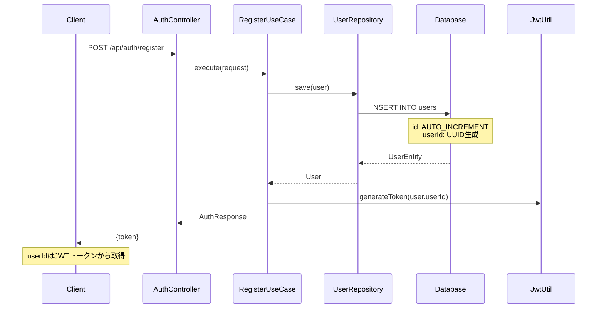
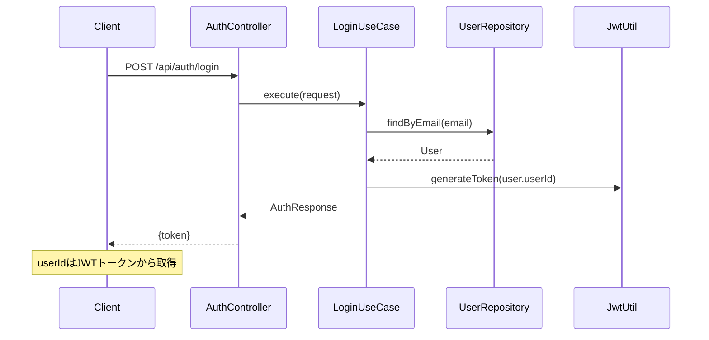
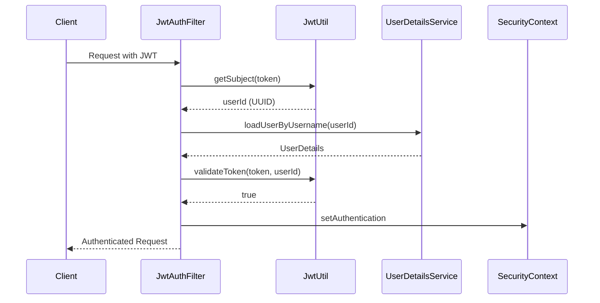
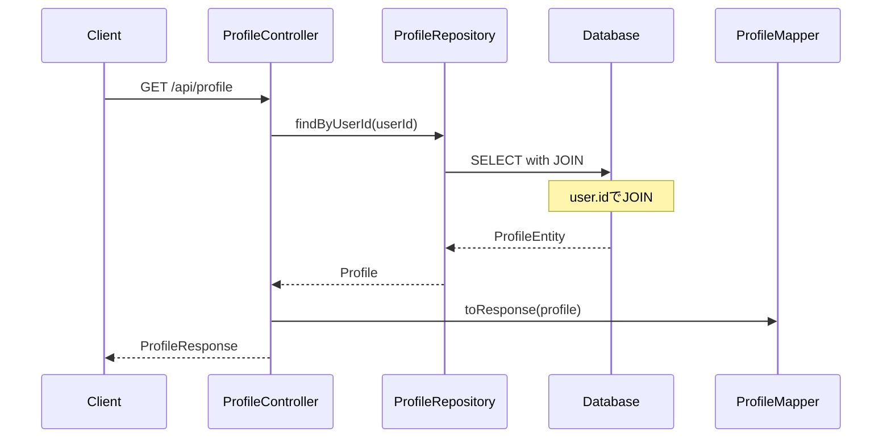

# ユーザーIDハイブリッド設計とJWT認証の改善

## 📋 目次

1. [概要](#概要)
2. [現在の実装の問題点](#現在の実装の問題点)
3. [ハイブリッド型設計の概要](#ハイブリッド型設計の概要)
4. [ハイブリッド型のメリット](#ハイブリッド型のメリット)
5. [実装詳細](#実装詳細)
6. [JWT認証の変更](#jwt認証の変更)
7. [処理フロー](#処理フロー)
8. [移行戦略](#移行戦略)
9. [セキュリティ考慮事項](#セキュリティ考慮事項)

## 📖 概要

本ドキュメントでは、現在のemailベースJWT認証から、ハイブリッド型ユーザーID設計（内部ID + 外部UUID）への移行について説明します。

### 設計方針
- **内部ID**: データベース内での高速処理用（AUTO_INCREMENT）
- **外部ID**: API公開用の安全な識別子（UUID）
- **JWT認証**: 外部ID（UUID）ベース

## ⚠️ 現在の実装の問題点

### 1. セキュリティリスク
```kotlin
// 現在の実装
fun generateToken(email: String): String {
    return Jwts.builder()
        .setSubject(email)  // 個人情報がJWTに含まれる
        .setIssuedAt(now)
        .setExpiration(expiryDate)
        .signWith(key, algorithm)
        .compact()
}
```

**問題点:**
- メールアドレスがJWTトークンに露出
- メールアドレス変更時に既存トークンが無効化
- 個人情報の漏洩リスク

### 2. パフォーマンス問題
- メールアドレスでの検索は、ID検索より遅い
- インデックスサイズが大きくなる
- JOIN操作の効率が悪い

### 3. プライバシー問題
- APIレスポンスでメールアドレスが露出
- ユーザー識別子として個人情報を使用

## 🎯 ハイブリッド型設計の概要

### 設計図
```
┌─────────────────────────────────────────┐
│              UserEntity                 │
├─────────────────────────────────────────┤
│ id: Long (主キー, AUTO_INCREMENT)       │ ← 内部処理用
│ userId: String (UUID, 外部識別子)       │ ← API公開用
│ username: String                        │
│ email: String                           │
│ password: String                        │
│ profile: ProfileEntity                  │
└─────────────────────────────────────────┘
                    │
                    ▼
┌─────────────────────────────────────────┐
│            ProfileEntity                │
├─────────────────────────────────────────┤
│ id: Long (主キー)                       │
│ user: UserEntity (user.idで関連付け)    │ ← 内部ID使用
│ nickname: String                        │
│ gender: Gender                          │
│ birthdate: LocalDate                    │
│ area: String                            │
│ occupation: String                      │
│ hasAnnualPass: Boolean                  │
└─────────────────────────────────────────┘
```

## ✅ ハイブリッド型のメリット

### 1. パフォーマンス最適化
- **内部処理**: 高速なLong型ID使用
- **外部API**: 安全なUUID使用
- **JOIN操作**: 最適化されたインデックス

### 2. セキュリティ向上
- **JWTトークン**: 予測不可能なUUID使用
- **情報保護**: 個人情報の露出を最小化
- **推測困難**: ユーザー数や登録順序の推測を防止

### 3. スケーラビリティ
- **分散システム対応**: UUIDによる一意性保証
- **マイクロサービス対応**: 各サービスで独立したID生成
- **データベース統合**: 複数DB間でのID重複回避

### 4. 柔軟性
- **内部/外部分離**: 異なる識別子の使い分け
- **将来対応**: 要件変更への対応力
- **API設計**: クリーンな外部API設計

## 🔧 実装詳細

### 1. UserEntityの変更

```kotlin
@Entity
@Table(name = "users")
class UserEntity(
    // 主キー（内部用、AUTO_INCREMENT）
    @Id
    @GeneratedValue(strategy = GenerationType.IDENTITY)
    var id: Long? = null,

    // 外部識別子（API用、UUID）
    @Column(nullable = false, unique = true, length = 36)
    var userId: String? = null,

    // 既存フィールド
    @Size(min = 1, max = 50)
    @Column(nullable = false, length = 50)
    var username: String,

    @Email
    @Size(max = 255)
    @Column(nullable = false, unique = true, length = 255)
    var email: String,

    @Size(min = 8, max = 255)
    @Column(nullable = false, length = 255)
    var password: String,

    @OneToOne(mappedBy = "user", cascade = [CascadeType.ALL], orphanRemoval = true)
    var profile: ProfileEntity? = null

) : BaseEntity() {
    
    @PrePersist
    fun prePersist() {
        if (userId == null) {
            userId = UUID.randomUUID().toString()
        }
    }
    
    // 既存メソッド...
}
```

### 2. ドメインモデルの変更

```kotlin
data class User(
    val id: Long? = null,           // 内部用
    val userId: String? = null,     // 外部用
    val username: String,
    val email: String,
    val password: String
)
```

### 3. APIレスポンスの変更

```kotlin
data class UserResponse(
    val userId: String,      // 外部IDのみ公開
    val username: String,
    val email: String
    // idは含めない
)

data class ProfileResponse(
    val profileId: Long,     // AUTO_INCREMENT ID
    val userId: String,      // UUID
    val nickname: String,
    val gender: Gender,
    val birthdate: LocalDate,
    val area: String,
    val occupation: String,
    val hasAnnualPass: Boolean
)
```

## 🔐 JWT認証の変更

### 1. JwtUtilの変更

```kotlin
@Component
class JwtUtil {
    
    // 既存の設定...
    
    /**
     * JWTトークンを生成する
     * @param userId ユーザーの外部ID（UUID）
     * @return 生成されたJWTトークン
     */
    fun generateToken(userId: String): String {
        val now = Date()
        val expiryDate = Date(now.time + expirationTimeMs)

        return Jwts.builder()
            .setSubject(userId)  // UUIDを使用
            .setIssuedAt(now)
            .setExpiration(expiryDate)
            .signWith(key, algorithm)
            .compact()
    }

    /**
     * トークンの有効性を検証する
     * @param token JWTトークン
     * @param userIdFromDb DBから取得したユーザーの外部ID
     * @return 有効な場合はtrue
     */
    fun validateToken(token: String, userIdFromDb: String): Boolean {
        return try {
            val userIdFromToken = getSubject(token)
            userIdFromToken == userIdFromDb && !isTokenExpired(token)
        } catch (ex: Exception) {
            false
        }
    }

    // 既存メソッド...
}
```

### 2. UserDetailsServiceの変更

```kotlin
@Service
class UserDetailsServiceImpl(
    private val securityUserRepository: SecurityUserRepository
) : UserDetailsService {

    override fun loadUserByUsername(userId: String): UserDetails {
        // userIdパラメータは実際にはUUID
        val user = securityUserRepository.findByUserId(userId)
            ?: throw UsernameNotFoundException("User not found with userId: $userId")

        return User.builder()
            .username(user.userId)  // UUIDをusernameとして使用
            .password(user.password)
            .authorities("USER")
            .build()
    }
}
```

### 3. SecurityUserRepositoryの変更

```kotlin
interface SecurityUserRepository {
    fun findByUserId(userId: String): UserEntity?
    fun findByEmail(email: String): UserEntity?
}

@Service
class SecurityUserRepositoryImpl(
    private val jpaUserRepository: JpaUserRepository
) : SecurityUserRepository {
    
    override fun findByUserId(userId: String): UserEntity? {
        return jpaUserRepository.findByUserId(userId)
    }
    
    override fun findByEmail(email: String): UserEntity? {
        return jpaUserRepository.findByEmail(email)
    }
}
```

## 🔄 処理フロー

### 1. ユーザー登録フロー



### 2. ログインフロー



### 3. JWT認証フロー



### 4. プロフィール取得フロー



## 📈 移行戦略

### Phase 1: データベーススキーマ変更
1. `users`テーブルに`user_id`カラム追加
2. 既存ユーザーにUUID生成
3. インデックス作成

### Phase 2: エンティティ・ドメインモデル変更
1. `UserEntity`に`userId`フィールド追加
2. `User`ドメインモデル更新
3. マッパー更新

### Phase 3: JWT認証変更
1. `JwtUtil`の`generateToken`メソッド変更
2. `UserDetailsService`更新
3. 認証フロー修正

### Phase 4: APIレスポンス変更
1. レスポンスDTO更新
2. マッパー修正
3. テスト更新

### Phase 5: テスト・検証
1. 単体テスト更新
2. 統合テスト実行
3. セキュリティテスト

## 🔒 セキュリティ考慮事項

### 1. UUID生成
- **UUID v4**: ランダム生成による予測困難性
- **一意性保証**: データベース制約による重複防止
- **生成タイミング**: `@PrePersist`による自動生成

### 2. JWTセキュリティ
- **Subject**: UUID使用による個人情報保護
- **有効期限**: 適切な期限設定
- **署名**: 強固な署名アルゴリズム

### 3. 情報漏洩防止
- **内部ID**: 外部APIで絶対に露出しない
- **外部ID**: APIレスポンスでのみ使用
- **ログ出力**: 個人情報のログ出力禁止

### 4. アクセス制御
- **認証**: JWTトークンによる認証
- **認可**: 適切な権限チェック
- **監査**: アクセスログの記録

## 📊 パフォーマンス比較

| 項目 | 現在（email） | ハイブリッド型 |
|------|---------------|----------------|
| **JWT生成** | 中 | 高 |
| **ユーザー検索** | 中 | 高 |
| **JOIN操作** | 中 | 高 |
| **ストレージ** | 中 | 中 |
| **セキュリティ** | 中 | 高 |
| **スケーラビリティ** | 低 | 高 |

## 🎯 結論

ハイブリッド型ユーザーID設計により、以下の改善が期待できます：

1. **セキュリティ向上**: 個人情報の保護と予測困難性
2. **パフォーマンス最適化**: 内部処理の高速化
3. **スケーラビリティ**: 将来の拡張性確保
4. **保守性**: クリーンな設計による保守性向上

この設計により、セキュアで高性能なユーザー認証システムを実現できます。 